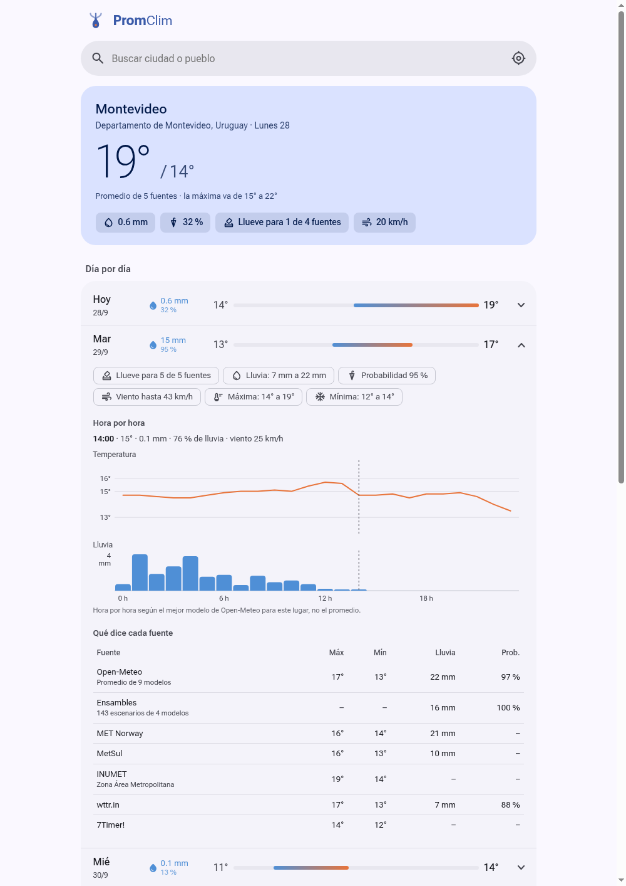

<p align="center"></p>

# PromClim

Junta el pronóstico de varias fuentes del clima y muestra el promedio día por
día, con cuánto se separan entre sí y qué dijo cada una.

<p align="center"></p>

## Arrancar

Necesitás Node 20 o más nuevo. No hace falta `npm install`: no usa dependencias.

**Como app (Linux con systemd), recomendado:**

```bash
./instalar.sh
```

Aparece **PromClim** en el menú de aplicaciones. El servidor no queda
corriendo: arranca solo cuando abrís la app y se apaga solo después de 20
minutos sin uso (`apagarSinUsoMin` en `config.local.json`). No pide `sudo`.
Para sacarlo: `./instalar.sh --quitar`.

**A mano:**

```bash
npm start
```

Y abrí <http://localhost:8741>.

El puerto es el 8741 y no el 8080 porque el 8080 lo usan por defecto muchos
programas. Si lo necesitás para otra cosa, cambiá `"puerto"` en
`config.local.json` y volvé a correr `./instalar.sh`.

## Fuentes

**Sin clave** (andan apenas lo arrancás):

| Fuente | Qué aporta |
|---|---|
| Open-Meteo | 9 modelos: ECMWF, ECMWF AIFS (IA), GFS, ICON, GEM, Météo-France, UKMO, JMA y CMA. 10 días |
| Ensambles (Open-Meteo) | 143 escenarios de ECMWF, GFS, ICON y GEM. Da la probabilidad de lluvia y la lluvia promedio |
| MET Norway (yr.no) | Global, por hora los primeros días. Hoy no cuenta porque ya va empezado |
| MetSul | 10 días, sur de Sudamérica (JSON interno de su web) |
| INUMET | 7 días, solo máxima y mínima, solo Uruguay (JSON interno de su web) |
| wttr.in | 3 días, datos de World Weather Online |
| 7Timer! | 7 días, solo máxima y mínima (modelo GFS) |

**Con clave gratis** (se activan cuando ponés la clave en `config.local.json`).
**Ojo: estas cinco están escritas según la documentación de cada API pero todavía no
se probaron con una clave real.** Si alguna falla, abrí un issue:

| Fuente | Plan gratis | Dónde se saca |
|---|---|---|
| AccuWeather | 50 consultas por día, 5 días | <https://developer.accuweather.com> |
| Foreca | prueba de 30 días | <https://developer.foreca.com> |
| OpenWeatherMap | 5 días | <https://home.openweathermap.org/api_keys> |
| WeatherAPI.com | 3 días | <https://www.weatherapi.com/signup.aspx> |
| Visual Crossing | 1000 registros por día | <https://www.visualcrossing.com/sign-up> |

- Cada proveedor cuenta **una vez** en el promedio: los 9 modelos de Open-Meteo
  se promedian entre sí primero, para que no le ganen por cantidad a los demás.
- Varias fuentes usan por debajo los mismos modelos (por ejemplo, MET Norway
  usa ECMWF fuera de Europa y 7Timer usa GFS), así que no son del todo
  independientes.
- Si una fuente falla o no cubre el lugar, se saltea y el promedio sigue con
  las demás. En la pantalla se ve cuál entró y cuál no.
- **BoosterAgro** no está: su web vieja ya no anda y la app del celular pide
  usuario. **SMN Argentina** publica un pronóstico por estación en texto, pero
  sin coordenadas; quedó para más adelante.

## Día por día

Cada día se abre al tocarlo y muestra:

- cuántas fuentes dan lluvia, el rango de lluvia, máxima y mínima entre fuentes;
- dos gráficos hora por hora (temperatura y lluvia), del mejor modelo de
  Open-Meteo para el lugar; al pasar el dedo o el mouse se leen los valores de
  cada hora;
- una tabla con lo que dice cada fuente ese día.

## Lluvia

Para cada día: milímetros promedio, probabilidad promedio y cuántas fuentes
dan lluvia (1 mm o más). También la lluvia acumulada en 3 y 7 días, la del
promedio y la de cada fuente.

## La estación de INUMET: ahora y ayer (solo Uruguay)

Si hay una estación automática de INUMET a menos de 40 km:

- **Ahora**: en la tarjeta de hoy se ve lo que mide la estación en este
  momento: temperatura, humedad, viento y ráfagas, la presión y si viene
  subiendo o bajando (en las últimas 3 horas; si baja, suele venir mal
  tiempo), y la lluvia de las últimas 24 horas.
- **¿Cómo le fue al pronóstico ayer?**: lo que midió la estación al lado de
  lo que se pronosticaba un día antes, con las conclusiones escritas: si hizo
  más calor o más frío de lo esperado, si llovió lo que se decía, cuántas
  fuentes lo vieron venir y cuál se acercó más. Las frases las arma PromClim
  con los números, no la IA, así que no se equivocan. Al abrir "Hora por
  hora" se ve la temperatura medida contra la pronosticada, y lo que había
  dicho cada fuente.
- El pronóstico de referencia es el promedio que PromClim guardó el día
  anterior. Si ese día no se guardó (la compu estaba apagada, o el lugar es
  nuevo), se usa lo que daba Open-Meteo un día antes, que Open-Meteo guarda
  en su [Previous Runs API](https://open-meteo.com/en/docs/previous-runs-api).
  De ahí sale también la línea pronosticada del gráfico.
- El análisis con IA también recibe esto, así puede decir, por ejemplo, que
  ayer los pronósticos se quedaron cortos con la lluvia.

INUMET marca el viento en "nudos", pero los valores coinciden con los km/h de
otras fuentes para el mismo lugar y hora, así que PromClim los toma como km/h.

## ¿Quién acierta acá? (solo Uruguay)

PromClim compara lo que pronosticó cada fuente con lo que midió la estación
automática de INUMET más cercana (hasta 40 km), y muestra el error medio de
cada una: cuántos grados le erra a la máxima y a la mínima, y en qué
porcentaje de los días acertó si llovía o no. El promedio también se evalúa,
para ver si de verdad le gana a las fuentes sueltas.

- Todos los días guarda lo que pronostica cada fuente para los días siguientes.
  Solo cuentan los pronósticos hechos de 1 a 7 días antes: el del mismo día es
  demasiado fácil.
- INUMET publica solo las últimas 72 horas de sus estaciones, así que PromClim
  guarda las observaciones dos veces por día (un temporizador que instala
  `./instalar.sh`; si la compu estaba apagada, corre al prenderla).
- Con **14 días verificados**, el promedio pasa a ser **ponderado**: cada
  fuente pesa según la inversa de su error en ese lugar. Una fuente con pocos
  días recibe un peso del medio. Se puede apagar con `"ponderar": false`.
- Los datos quedan en `~/.local/share/promclim` (dos archivos JSON), nunca
  en el repo.

## Análisis con IA

El botón "Analizar" le pasa a una IA todo lo que dijo cada fuente y el
promedio, y te devuelve un resumen: lluvia, temperaturas, en qué no coinciden
las fuentes y algún consejo. Corre en tu compu con [Ollama](https://ollama.com):
gratis, sin cuentas ni claves, y los datos no salen de tu máquina.

```bash
# Arch Linux (en otros sistemas: https://ollama.com/download)
sudo pacman -S ollama
sudo systemctl enable --now ollama
ollama pull gemma3:4b      # unos 3 GB
```

Con otro modelo, cambiá `ia.modelo` en `config.local.json`. En una compu sin
placa de video, un modelo de 4B tarda más o menos un minuto en escribir el
análisis.

## Claves y configuración

1. Copiá `config.ejemplo.json` a `config.local.json`. Ese archivo no se sube
   a git.
2. Pegá las claves que tengas. Las que queden vacías se saltean.
3. Reiniciá el servidor. Al arrancar muestra qué fuentes quedaron activas.

## Cómo está armado

```
server.js              servidor HTTP + /api/buscar, /api/pronostico, /api/analisis y /api/resumen
sistema/               arranque bajo demanda (systemd) y acceso en el menú de apps
lib/fuentes/*.js       una fuente por archivo, todas devuelven el mismo formato
lib/promedio.js        el promedio (media, rango, cuántas fuentes) y la lluvia acumulada
lib/ia.js              arma el mensaje para la IA y habla con Ollama
lib/horario.js         hora por hora de Open-Meteo para el detalle de cada día
lib/verificacion.js    guarda pronósticos y observaciones de INUMET y calcula quién acierta
lib/estacion.js        lo que mide la estación de INUMET: ahora y hora por hora
lib/ayer.js            ayer: lo medido contra lo pronosticado, con las conclusiones
lib/util.js            fetch con timeout, caché en memoria y paso de horas a días
public/                la página (HTML, CSS y JS sin frameworks)
public/fuentes/        Roboto Flex y Material Symbols recortados, con sus licencias
```

Cada fuente devuelve una lista de días `{ fecha, max, min, lluvia, prob,
viento }` con `null` donde no tiene el dato. Para sumar una fuente nueva se
copia un archivo de `lib/fuentes/` y se agrega a la lista `FUENTES` de
`server.js`.

Las respuestas se guardan en memoria un rato (entre 10 minutos y 3 horas,
según la fuente) para no molestar a las fuentes ni gastar las consultas
gratis.

## Limitaciones

- **Que sea un promedio no lo hace más preciso.** Promediar modelos suele
  andar mejor que elegir uno al azar, pero recién se sabe si en tu lugar le
  gana a cada fuente después de unas semanas de verificación, y solo en
  Uruguay (donde hay estaciones de INUMET para comparar). Afuera de Uruguay
  todas las fuentes pesan lo mismo.
- **La verificación es chica**: una estación, un lugar, con los días que la
  compu estuvo prendida. Sirve para ver tendencias en tu zona, no es un
  estudio científico. La estación mide cada hora, así que la máxima y la
  mínima reales pueden ser un poco más extremas.
- **Las fuentes no son del todo independientes**: varias usan por debajo los
  mismos modelos (ECMWF, GFS), así que esos pesan más de lo que parece.
- **MetSul e INUMET pueden dejar de andar** cualquier día: no tienen API
  pública y se usan los mismos pedidos que hacen sus páginas.
- La IA corre en tu compu con un modelo chico: sin placa de video tarda cerca
  de un minuto y a veces escribe raro. Los números se los da PromClim ya
  calculados, para que no se equivoque en eso.

## Tests

```bash
npm test
```

Cubren el promedio (simple y ponderado), la lluvia acumulada, el paso de
horas a días según la zona horaria, la verificación contra estaciones y los
datos que recibe la IA. Las fuentes no tienen tests
automáticos porque dependen de servicios de afuera.

## Seguridad

PromClim no tiene usuarios ni contraseña, así que está armado para que solo lo
uses vos, desde tu compu:

- **Escucha solo en tu compu** (`127.0.0.1`). Otras compus de la red no llegan.
- **Otras páginas no lo pueden usar.** Si tenés abierta otra página en el
  navegador, no puede pedirle datos ni análisis a PromClim por atrás (se
  rechazan los pedidos que no vienen de la propia página, y los que llegan con
  otro nombre de servidor, para frenar el *DNS rebinding*).
- **La página no carga nada de afuera.** Las fuentes tipográficas vienen en el
  repo y la política de seguridad (CSP) no deja cargar scripts, estilos ni
  fuentes de otros sitios.
- **Las claves no salen de tu compu**: viven en `config.local.json` (fuera de
  git), las usa solo el servidor, y los mensajes de error nunca muestran las
  URLs que las llevan.
- **Límites**: un análisis de IA por vez (se corta si cerrás la página y a los
  5 minutos), respuestas de las fuentes de hasta 5 MB y memoria de caché con tope.

Si querés entrar desde el celular o desde otra compu de tu casa, poné en
`config.local.json` `"host": "0.0.0.0"` y en `"hostsPermitidos"` la dirección
con la que vas a entrar (por ejemplo `"192.168.1.20:8741"`). Tené en cuenta
que cualquiera en esa red va a poder usar tus claves y tu IA. No lo expongas a
internet.

Para reportar un problema de seguridad, mirá [SECURITY.md](SECURITY.md).

## Para uso personal

PromClim está pensado para que cada uno lo corra en su propia compu, con sus
propias claves. No es para montarlo como página
pública: MetSul e INUMET no tienen API pública (se usan los mismos pedidos que
hacen sus páginas) y los planes gratis de las APIs con clave tienen límites
por clave. La app muestra de qué fuente sale cada dato, con enlace a cada una.

## Íconos

Los íconos (Material Symbols) están recortados a los que usa la página, para
que pese 5 KB. Para sumar uno, agregalo a la lista y volvé a bajar el archivo:

```bash
ICONOS="ac_unit,air,auto_awesome,check,check_circle,cloud_off,error,expand_more,how_to_vote,humidity_percentage,location_on,my_location,partly_cloudy_day,remove_circle,search,sensors,speed,table_chart,thermostat,travel_explore,umbrella,water_drop"
UA="Mozilla/5.0 (X11; Linux x86_64) AppleWebKit/537.36 (KHTML, like Gecko) Chrome/130.0.0.0 Safari/537.36"
URL=$(curl -s -A "$UA" "https://fonts.googleapis.com/css2?family=Material+Symbols+Rounded:opsz,wght,FILL,GRAD@24,400,0..1,0&icon_names=$ICONOS" | grep -oE 'https://fonts.gstatic.com/[^)]+')
curl -s "$URL" -o public/fuentes/material-symbols-rounded.woff2
```

La lista tiene que ir en orden alfabético.

## Cómo se hizo

PromClim es de Franco Feijó, que no es programador: la idea, qué fuentes
usar, cómo tenía que verse y funcionar, y las pruebas de uso real son suyas.
**El código lo escribió Claude**, la IA de Anthropic, trabajando con Claude
Code a partir de lo que Franco iba pidiendo. Si encontrás algo raro en el
código, abrí un issue igual: se revisa y se arregla.

## Licencia

El código es [MIT](LICENSE) © 2026 Franco Feijó. Las fuentes tipográficas de
`public/fuentes/` tienen sus propias licencias: Roboto Flex (SIL OFL 1.1) y
Material Symbols (Apache 2.0), con los textos en esa misma carpeta. Los datos
del clima son de cada fuente y se rigen por sus condiciones.
